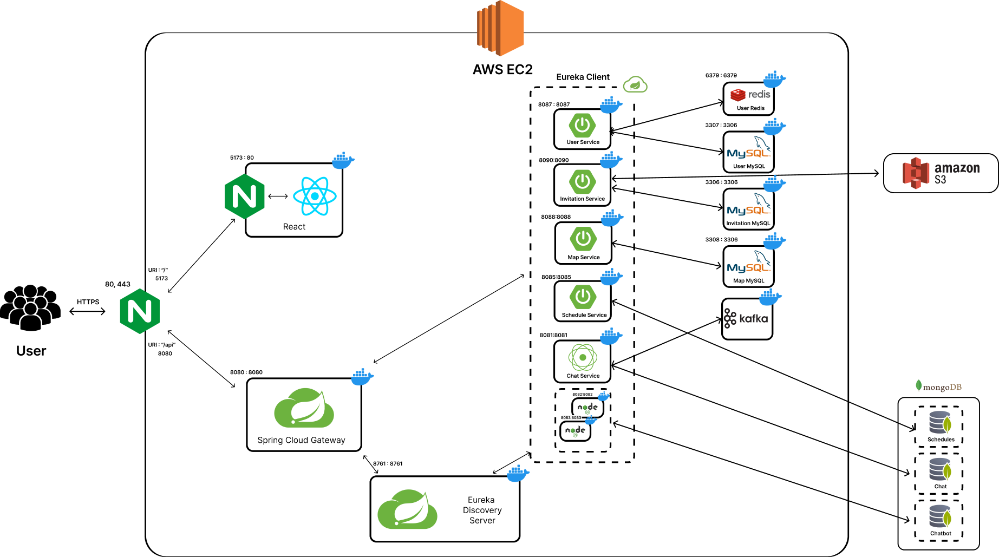

# 💌 일초, 초대장 서비스

## 프로젝트 소개

삼성청년SW아카데미 공통프로젝트로 시작된 **일초**는 "일상으로 초대"라는 뜻을 담고 있는 초대장 서비스입니다. 일초는 일상의 일반적인 약속을 조금 더 특별하게 기억할 수 있도록 돕는 것을 목표로 개발되었습니다.

이 서비스는 단순한 초대장 형식에서 벗어나, 사용자들이 일상 속의 약속들을 더욱 의미 있게 기록하고 공유할 수 있도록 돕습니다. 일초를 통해 초대장에 개인화된 메시지와 디자인을 더하여, 소중한 순간들을 잊지 못할 추억으로 만들어줍니다.

현재 일초는 100명 이상의 유저가 사용하고 있으며, 꾸준히 운영되고 있습니다. 더 자세한 정보와 서비스 이용은 일초 사이트에서 확인하실 수 있습니다.

> 기획/설계 기간 : 2024.07.08 ~ 2024.07.17
>
> 개발 기간 : 2024.07.18 ~ 
>
> 운영 기간 : 2024.08 ~

[일초 : 일상으로 초대 💌](https://il-cho.site)

## 서비스 아키텍처

## 제공 기능
1. 소셜 로그인
2. 맞춤형 초대장 생성 기능
    1. 사진부터 글꼴, 스티커까지 커스텀 가능
    2. 일정, 위치, 계좌 정보를 선택적으로 제공
    3. 참석 여부 표시
3. 링크 주소만으로 채팅방 개설하여 대화 가능
4. 생성형 AI API를 활용한 초대장 관련 정보를 제공하는 챗봇 기능

## 기술 스택

### Environment

Git, Github

### Development

Spring Boot, Spring Security, JPA, Node.js, MySQL, mongo DB, Redis

### CI/CD

Jenkins, Docker, EC2

### Test, Monitoring

SonarQube, K6, Grafana, Prometheus

### Communication

Figma, Notion, Jira, Mattermost

## 관련 링크

### 시연 시나리오

[시연 시나리오](https://www.notion.so/c832f8b788bf40568af80b1a9714b872?pvs=21) 

### Figma

[https://www.figma.com/embed?embed_host=notion&url=https%3A%2F%2Fwww.figma.com%2Fdesign%2FgaW5Ivlm9DOIVtyzD5CNlZ%2F%EC%B4%88%EB%8C%80%EC%9E%A5-%EC%84%9C%EB%B9%84%EC%8A%A4%3Fnode-id%3D0-1%26t%3DBxXsDvylp9pZvp3y-1](https://www.figma.com/embed?embed_host=notion&url=https%3A%2F%2Fwww.figma.com%2Fdesign%2FgaW5Ivlm9DOIVtyzD5CNlZ%2F%EC%B4%88%EB%8C%80%EC%9E%A5-%EC%84%9C%EB%B9%84%EC%8A%A4%3Fnode-id%3D0-1%26t%3DBxXsDvylp9pZvp3y-1)

### ERD

https://www.erdcloud.com/d/sujBrFmMabLKnYqf6

### API

[https://grateful-celsius-738.notion.site/dbad85bf5fe245a8b8c85ccf0c95140d?v=b87ace27da744a4b92bfdda319a96fac](https://www.notion.so/dbad85bf5fe245a8b8c85ccf0c95140d?pvs=21)

### UCC

https://youtu.be/w7IjH3orgAg

## 팀 정보

| 이름   | 역할      | Github                        | 구글 ID                  | Figma                    | Notion                   |
| ------ | --------- | ----------------------------- | ------------------------ | ------------------------ | ------------------------ |
| 지수영 | 팀장 / FE | https://github.com/SooYoungJi | jisooyoung97@gmail.com   | jisooyoung97@gmail.com   | jisooyoung97@gmail.com   |
| 박경림 | BE        | https://github.com/g16rim     | pkl4693@gmail.com        | pkl4693@gmail.com        | pkl4693@g.hongik.ac.kr   |
| 박상욱 | BE / FE   | https://github.com/sw0501     | dkxkqkrtkddn@gmail.com   | dkxkqkrtkddn@gmail.com   | dkxkqkrtkddn@sju.ac.kr   |
| 이창현 | BE        | https://github.com/Aldin0233  | changhyunlee96@gmail.com | changhyunlee96@gmail.com | changhyunlee96@gmail.com |
| 박정선 | BE / FE   | https://github.com/parkjumsun | pjsw8361@gmail.com       | pjsw8361@gmail.com       | pjsw8361@gmail.com       |
| 안현욱 | BE        | https://github.com/hyunuk17   | dksgusdnr17@gmail.com    | dksgusdnr17@gmail.com    | dksgusdnr17@gmail.com    |